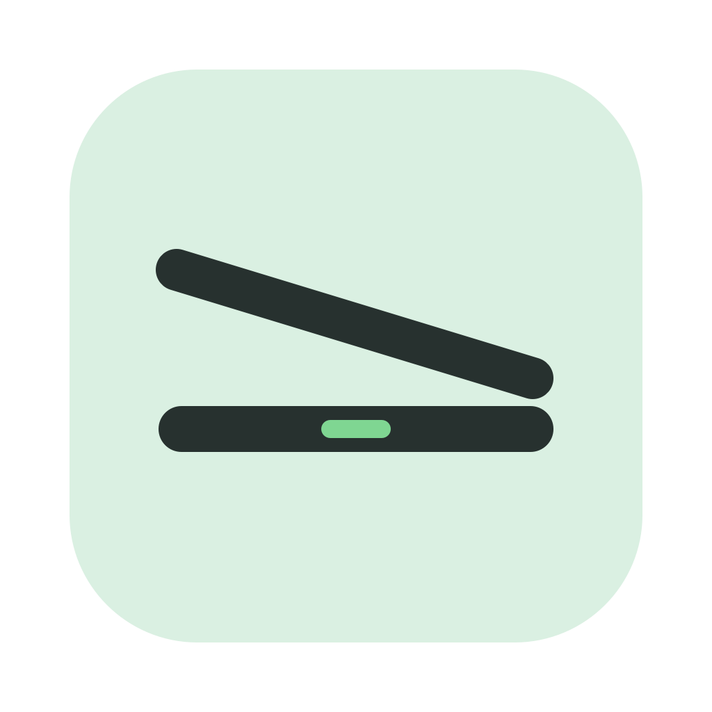
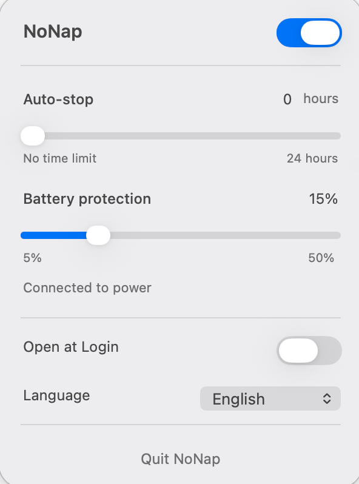

<p align="center">
  
</p>

<h1 align="center">NoNap</h1>

<p align="center"><strong>Close the lid. Keep it working.</strong></p>
<p align="center"><a href="README.zh-CN.md">简体中文</a></p>

NoNap is a small macOS menu-bar utility for long-running local work. Turn it on before closing your MacBook and the system can continue compiling, downloading, training, or running an agent without an external display.

It changes the native `pmset disablesleep` setting. No daemon, kernel extension, account, or telemetry is involved.

## Interface

<p align="center">
  
</p>

## What you get

- One switch for lid-closed operation.
- A 0–24 hour countdown shown as `hours:minutes` (`10:00 → 9:59`) with a matching slider; `0` means no limit.
- A configurable battery cutoff from 5% to 50%.
- Automatic stop when macOS Low Power Mode becomes active on battery.
- A display-only battery-time estimate based on macOS IOKit data.
- Optional Open at Login and English / Simplified Chinese UI.

NoNap remembers a manual language selection. On first launch, it uses Simplified Chinese when the Mac's preferred language starts with `zh`; otherwise it uses English.

## Install

NoNap currently targets Apple silicon Macs running macOS 26 or later.

```sh
git clone https://github.com/Tsan1024/NoNap.git
cd NoNap
./install.sh
```

The installer builds `/Applications/NoNap.app`, asks once for administrator approval, installs a narrowly scoped sudoers rule, and launches the app.

That rule permits only these two commands for the current user:

```text
/usr/bin/pmset -a disablesleep 0
/usr/bin/pmset -a disablesleep 1
```

To build without installing anything:

```sh
./build.sh
```

To create a DMG:

```sh
./package.sh
```

## Remove

```sh
./uninstall.sh
```

The uninstaller restores normal sleep, removes the app and login item, deletes the sudoers rule, and verifies that passwordless `pmset` access is gone.

## Safety notes

Lid-closed operation can increase heat and battery use. Keep the Mac ventilated, choose a battery cutoff, and use a finite timer when leaving work unattended. The battery-time estimate changes with workload and never controls the safety cutoff.

See [SECURITY.md](SECURITY.md) for the permission model and [docs/AUDIT.md](docs/AUDIT.md) for verification steps.

## Acknowledgements

NoNap began as a derivative of [Sleepless](https://github.com/Aboudjem/Sleepless), created by Adam Boudjemaa. Thanks to Adam and the Sleepless project for the original menu-bar implementation and `pmset` approach. NoNap is independently maintained and is not an official Sleepless release. Original copyright notices are retained under the MIT license.

## License

[MIT](LICENSE)
