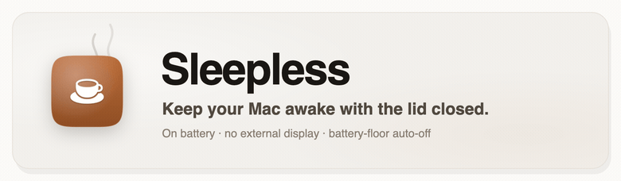
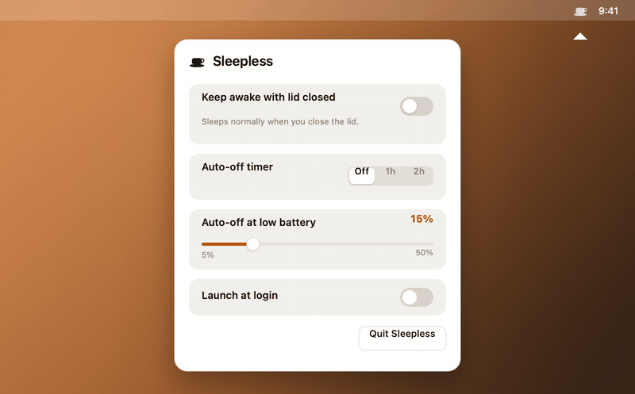

# StayAwake

盖上吧，活儿还在跑。

本项目基于 [Sleepless](https://github.com/Aboudjem/Sleepless) fork 并修改，原作者为 **Adam Boudjemaa（Aboudjem）**。感谢原项目提供的菜单栏应用与 `pmset` 合盖保持唤醒实现；本分支增加了权限与退出保护改进、中英文切换、自定义定时及界面调整。保留原作者版权声明，并沿用 [MIT 许可证](LICENSE)。本项目为独立维护的衍生版本，并非原作者官方发布。

> 应用显示名称已更改；为兼容现有安装与设置，仓库、应用标识及 `Sleepless.app` 安装路径暂时保留原名。下方动图来自上游 Sleepless，尚未更新为本版界面。

<!-- Language switcher. Keep this row identical across every README.<lang>.md. -->
<p align="center">
  <b>English</b> &nbsp;·&nbsp;
  <a href="README.zh-CN.md">简体中文</a> &nbsp;·&nbsp;
  <a href="README.es.md">Español</a> &nbsp;·&nbsp;
  <a href="README.ja.md">日本語</a> &nbsp;·&nbsp;
  <a href="README.fr.md">Français</a> &nbsp;·&nbsp;
  <a href="README.de.md">Deutsch</a>
</p>

> 本翻译由社区或机器生成，可能落后于英文版 README。请以英文版本为准。请参阅 [English README](README.md)。

<p align="center">
  <picture>
    <source media="(prefers-color-scheme: dark)" srcset="assets/hero-dark.gif">
    <source media="(prefers-color-scheme: light)" srcset="assets/hero-light.gif">
    
  </picture>
</p>

<p align="center">
  <b>合盖、使用电池、没有外接显示器，照样让 MacBook 保持唤醒。</b><br>
  <sub>一个菜单栏开关，配自动关闭定时器和电量下限截止，让你永远不会把电耗光。</sub>
</p>

<p align="center">
  <a href="LICENSE"></a>
  
</p>
<p align="center">
  
  
</p>

<p align="center">
  
</p>

> [!NOTE]
> 合上盖子会让 Mac 睡眠，基于 `caffeinate` 的应用（KeepingYouAwake 之类）从设计上就改变不了这件事。Sleepless 切换 `pmset disablesleep`，并增加定时、电量和正常退出保护。

## 安装

```sh
git clone https://github.com/Tsan1024/Sleepless.git
cd Sleepless
./install.sh
```

第一次打开开关时，macOS 会请求一次管理员授权并安装严格限定范围的规则。

| 其他方式 | |
|---|---|
| **仅构建、不安装** | `./build.sh` 会生成 `build/Sleepless.app`，不会修改 sudoers。 |
| **制作 DMG** | `./package.sh` 会生成 `dist/Sleepless-1.3.0.dmg` 及其 SHA-256 文件。 |

然后点击菜单栏里的咖啡杯，拨动开关，合上盖子。

## 功能特性

主界面仅保留可点击的电源图标和口号。
点击“⋯”进入设置页，点击“返回”回到主页；设置页集中提供 0–24 小时自动停止滑块和输入框
（0 表示不限时）、电量保护与估算、登录启动、语言及退出，必要说明通过悬停提示查看。

电池供电时，通过 macOS IOKit 获取系统预计耗尽时间，再换算到保护阈值：
`系统剩余分钟 ×（当前电量百分比 − 保护阈值）/ 当前电量百分比`。
结果按约 5 分钟粒度展示，会随工作负载变化；接电、估值不可用和已达保护阈值分别提示。
该估算只供参考，不参与自动关闭判断，实际仍由定时器、电量阈值及低电量模式保护决定。

| | | |
|---|---|---|
| ☕ | **一个开关** | 点击菜单栏里的咖啡杯，拨动开关。 |
| ⏲️ | **自动关闭定时器** | 滑动或输入 0–24 小时；0 表示不限时。 |
| 🔋 | **电量下限** | 电池供电时在 5–50% 自动关闭（默认 15%）。 |
| 🪫 | **Low Power Mode** | 电池供电下若 LPM 开启，自动让位。 |
| 🖥️ | **无需转接** | 合盖、电池供电即可。不用显示器，不用 HDMI 插头。 |
| 🚀 | **登录时启动** | 可选，默认关闭，不会自行开启防休眠。 |
| 🌐 | **English / 中文** | 直接在弹窗中切换语言。 |
| 🪶 | **小巧且原生** | 一个 AppKit 文件。无 Dock 图标、守护进程或 kext。 |

**菜单栏图标：** 空杯 = 关闭 · 满杯 = 唤醒 · 满杯加一个点 = 电池供电下唤醒（自动关闭生效中）。

## Sleepless 与其他方案对比

| | **Sleepless** | Amphetamine | KeepingYouAwake | `caffeinate` |
|---|:---:|:---:|:---:|:---:|
| 合盖、无显示器时保持唤醒 | ✅ ¹ | ⚠️ ² | ❌ ³ | ❌ |
| 电池供电 | ✅ | ✅ | ✅ 开盖 | ⚠️ ⁴ |
| 自动关闭定时器 | ✅ | ✅ | ✅ | ❌ |
| 低电量时自动关闭 | ✅ | ✅ | ✅ | ❌ |
| 开源 | ✅ MIT | ❌ App Store | ✅ MIT | Apple |
| 价格 | 免费 | 免费 | 免费 | 免费 |

<sub>数据截至 2026-06。¹ 使用 `pmset disablesleep` 并把标志读回来；具体表现取决于硬件和 macOS 版本。² 有记载支持合盖显示模式，但被普遍反映会在电源切换时于 Apple Silicon 上失效（[AE #28](https://github.com/x74353/Amphetamine-Enhancer/issues/28)）；应用本身闭源。³ 从设计上就做不到合盖唤醒，因为它封装的是 `caffeinate`（[#66](https://github.com/newmarcel/KeepingYouAwake/issues/66)）。⁴ `caffeinate -i` 可在电池供电下运行；`-s` 仅在接通电源时有效。</sub>

## 用它来……

- 🤖 合盖跑完通宵任务：智能体运行、构建、渲染、ML 训练。
- 📡 从包里共享一个热点。
- ⬇️ 让大文件下载、上传或备份继续运行。
- 🖥️ 让本地服务器或 SSH 会话保持可达。

> [!TIP]
> 设一个你信得过的电量下限（比如 20%）再加一个定时器，你就能放心走开，不用一直盯着电量。

## 工作原理

Sleepless 切换 `pmset disablesleep`（内核的 `SleepDisabled` 标志），把它读回来让菜单栏绝不撒谎，并在到达你的电量下限、进入 Low Power Mode、定时器结束、正常退出或重启时把它还原。首次使用时，原生管理员授权会安装一条范围严格限定的 sudoers 规则，**只允许两条命令**：

```
<you> ALL=(root) NOPASSWD: /usr/bin/pmset -a disablesleep 0, /usr/bin/pmset -a disablesleep 1
```

- **无法被放宽。** sudoers 按字面匹配参数，没有通配符。
- **没有可替换的 root 脚本。** 首次设置从正在运行的 App 写入并校验固定规则；日常开关用参数数组直接调用 `/usr/bin/pmset`。
- **始终可逆。** 正常退出、重启、电量下限、定时器或 `./uninstall.sh` 都会恢复休眠。

验证一个下载，无需 Apple 账户：

```sh
shasum -a 256 -c dist/Sleepless-1.3.0.dmg.sha256
```

完整威胁模型、为何无法上架 App Store，以及审计指南：[SECURITY.md](SECURITY.md) · [docs/AUDIT.md](docs/AUDIT.md)。

## 常见问题

<details>
<summary><b><code>pmset disablesleep</code> 在 Apple Silicon（M1/M2/M3）上还有效吗？</b></summary>

有效。`pmset -a disablesleep 1` 会在 Apple Silicon 上设置内核的 `SleepDisabled` 标志，已在 macOS 26.3 上第一手确认，能让 Mac 在合盖、电池供电下保持唤醒。用 `pmset -g | grep SleepDisabled` 验证（应读作 `1`）。说它“不再有效”的说法，通常描述的是 `caffeinate` 或基于 caffeinate 的应用，那是另一套机制。
</details>

<details>
<summary><b>为什么装了 Amphetamine 或 KeepingYouAwake，合盖时 Mac 还是会睡眠？</b></summary>

那些工具用的是 macOS 电源断言，它能停掉空闲计时器，却无法覆盖硬件层面的合盖触发。KeepingYouAwake 封装的是 `caffeinate`，做不到合盖唤醒（[#66](https://github.com/newmarcel/KeepingYouAwake/issues/66)）。而 Sleepless 使用的 `pmset disablesleep` 可以。
</details>

<details>
<summary><b>合盖运行安全吗？会过热或耗光电池吗？</b></summary>

对于下载、同步、共享热点这类轻量、无人看管的任务来说是安全的。完全合盖下长时间高负载会限制散热气流，所以请自己掂量。电量下限、Low Power Mode 自动关闭和定时器都会在 Mac 电量见底之前把它停下来。
</details>

<details>
<summary><b>它需要 sudo、内核扩展或后台守护进程吗？</b></summary>

它需要一条范围严格限定的 `sudo` 授权（两条精确的 `pmset` 命令），这样 GUI 应用才能在不弹密码提示的情况下切换设置。没有内核扩展，也没有守护进程。整个应用就是一个 AppKit 文件。
</details>

<details>
<summary><b>怎样停止它或移除它？</b></summary>

把开关关掉、正常退出 App，或者让定时器或电量下限替你关掉它，正常睡眠就会恢复。重启同样会把它重置。`./uninstall.sh` 会移除应用、登录项和 sudoers 授权，然后证明授权已经清除。
</details>

<details>
<summary><b>为什么它没有公证？</b></summary>

它是一个个人的开源工具，没有付费的 Apple Developer ID，所以采用临时签名（ad-hoc）。从源码构建可以跳过 Gatekeeper，或者对预构建的应用使用 **仍要打开**。公证步骤记录在 [docs/AUDIT.md](docs/AUDIT.md) 中。
</details>

## 参与贡献

欢迎提交 Issue 和 PR，尤其欢迎翻译以及来自其他硬件的测试报告。请参阅 [CONTRIBUTING.md](CONTRIBUTING.md) 和[行为准则](CODE_OF_CONDUCT.md)。Sleepless 会刻意保持小巧。

## 许可证

[MIT](LICENSE) © 2026 Adam Boudjemaa。

<p align="center">
  <sub>如果 Sleepless 帮你省去了一趟终端，点个 ⭐ 能帮助更多人发现它。</sub>
</p>
